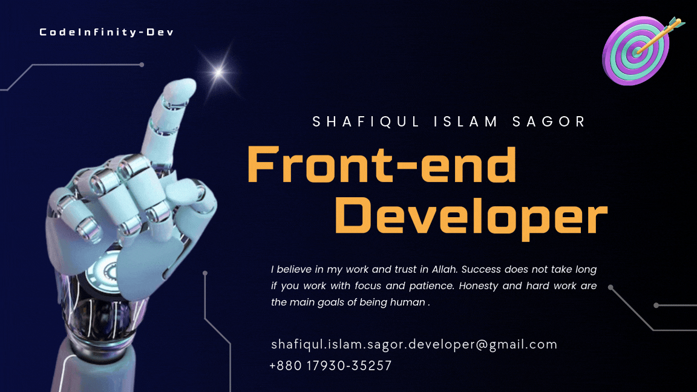

  

<!--👀VIEWS / 🌐WEBSITE: https://github.com/antonkomarev/github-profile-views-counter -->

## :eyes: Current overview

### 🔭 I’m working - I don't work in any company, I am busy building my skills. 
### 🌱 I’m exploring - Mongoose and Express.js . 
### 👯 I’m looking - For Fresher frontend developer job. 
### 🤔 I’m trying - To solve code errors and explore new technologies. 
### ⚡ Fun fact - I like to learn new things from anyone.

 

### Working on my `GitHub stats` haha...

<!--- stats & Trophy (start) -->

  <!--- stats (start) -->
<table align="center">
<tr border="none">
<td width="50%" align="center">
  
  
    

 
</td>

<td width="50%" align="center">

  
  
  </td>
</tr>
</table>
<!--- stats (end) -->

<!--- trophy (start) -->

  

<!--- trophy (start) -->

        
<!--- stats (end) -->  

### - Skills and Tools...

> Tools and technologies that I have worked with and am interested in

<table>
  <tr>
    <td align="center" width="96">
        
       React
    </td>
     <td align="center" width="96">
        
       Next JS
    </td>
    <td align="center" width="96">
      
       Typescript
    </td>
    <td align="center" width="96">
        
       Javascript
    </td>
    <td align="center" width="96">
        
       Redux
    </td>
     <td align="center"  width="96">
        
       HTML
    </td>
    <td align="center" width="96">
        
       CSS
    </td>
    <td align="center" width="96">
        
       CSS
    </td>
    <td align="center" width="96">
        
       CSS
    </td>
     <td align="center"  width="96">
        
       Bootstrap
    </td>
    <td align="center" width="96">
        
       Tailwind
    </td>
   
  </tr>
 
   <tr>
    <td align="center" width="96">
        
       VS Code
    </td>
        <td align="center" width="96">
        
       Postman
    </td> 
        <td align="center" width="96">
        
        
          Figma
    </td> 
        <td align="center" width="96">
        
       Github
    </td>
        <td align="center" width="96">
        
       API
    </td>
       <td align="center" width="96">
        
       Git
    </td>
       <td align="center" width="96">
        
       MongoDB
    </td>
      <td align="center" width="96">
        
       Sass
    </td>
  </tr>
 <tr>
 </tr>
</table>
 

  <em>
   
  <h4 align="center"><i>"---🥰 I do the ones I like anyway. I will also fulfill my dreams inshallah 🥰---"</i></h4>
   
  <h4 align="center"><i>"---Always Work Hard and Trust the Process---"</i></h4>
  <h4 align="center"><i>"Last Update : 16 december 2024"</i></h4>

  

**😝🥹কোড দেখলে মাথা ঘুরায়🥹😝** 

&nbsp;&nbsp;&nbsp;&nbsp;&nbsp;

&nbsp;&nbsp;&nbsp;&nbsp;&nbsp;
 

 

 
<!--📈ACTIVITYGRAPH / 🌐WEBSITE: https://github.com/Ashutosh00710/github-readme-activity-graph -->

<!--📏LINE-->

<!--📰RSS / TAKE IMAGE FROM https://github.com/trinib/trinib/blob/main/images/marquee.svg TO YOUR REPO AND EDIT IT-->

<!--🎨CAPSULE / 🌐WEBSITES: https://github.com/kyechan99/capsule-render -->

