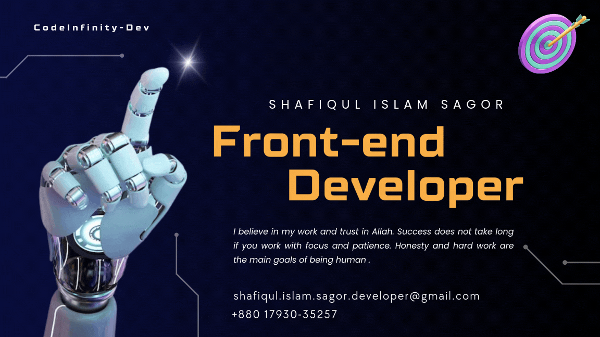

  

  
  
  

  

  

  

## 🚀 About Me

- 💼 **Experience:** 1+ year in frontend development
- 🔭 **Current Focus:** Fullstack products with Next.js, Express.js, and MongoDB
- 🌱 **Learning Now:** Advanced React patterns, TypeScript, and API architecture
- 🎯 **Goal:** Build clean, scalable, and user-first digital products
- 📫 **Email:** [shafiqul.islam.sagor.developer@gmail.com](mailto:shafiqul.islam.sagor.developer@gmail.com)

## 🧠 Tech Stack

  

## 💼 Experience Snapshot

| Period | Role | Organization/Project | Core Stack |
|---|---|---|---|
| Jul 2023 – Oct 2024 | Frontend Developer | TechnoGenix Solutions | React, Tailwind CSS, REST API |
| Nov 2024 – Jun 2025 | Fullstack Developer | Raintor | Next.js, Express.js, MongoDB |

## 📊 GitHub Insights

  
  

  

## 🌐 Connect With Me

  
  
  

  

