<!--
  All artwork in this README is generated by scripts/generate-readme-assets.js
  Edit the data at the top of that file, then run: node scripts/generate-readme-assets.js
-->

  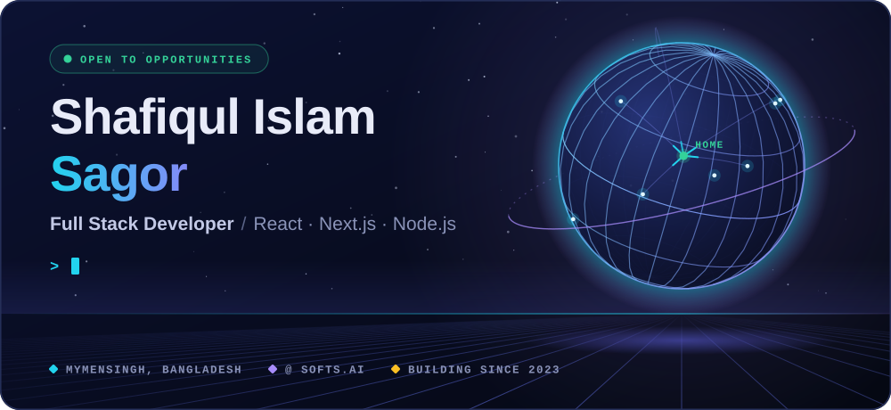

  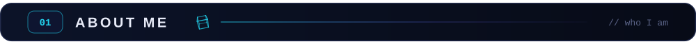
  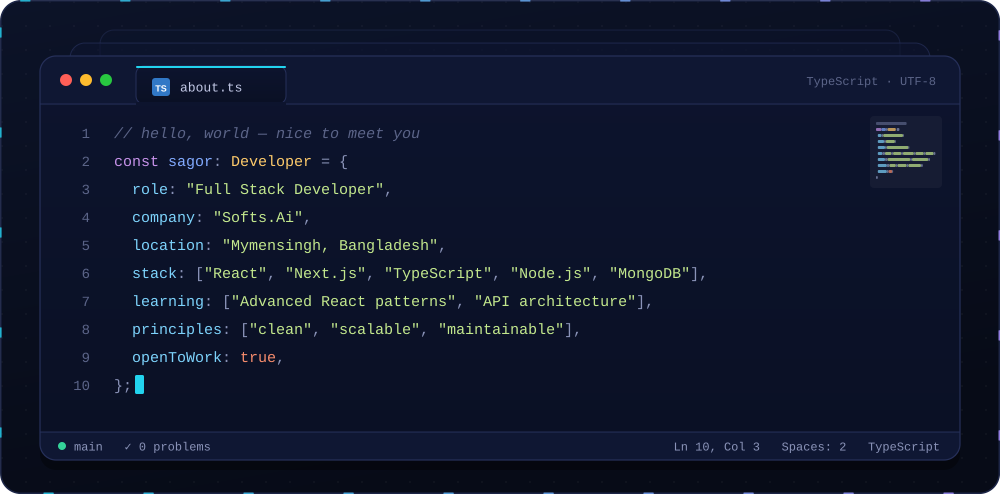

  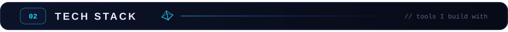
  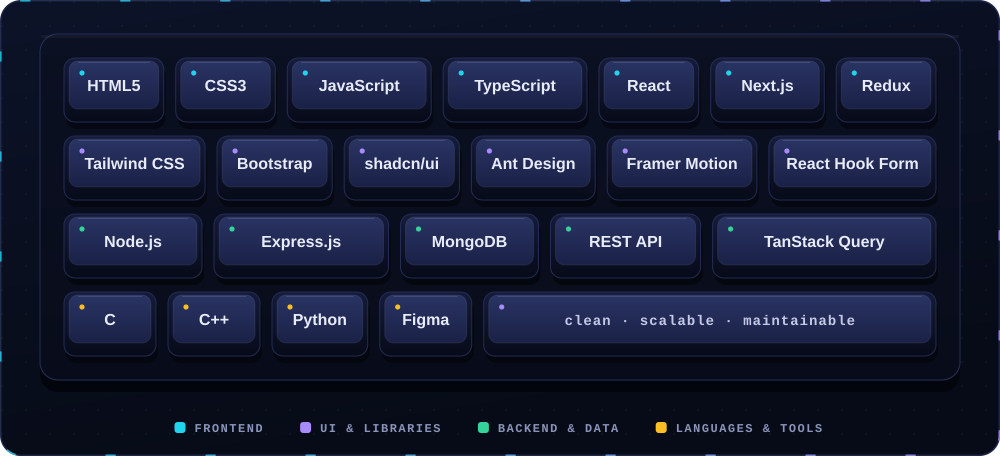

  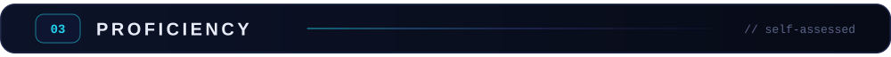
  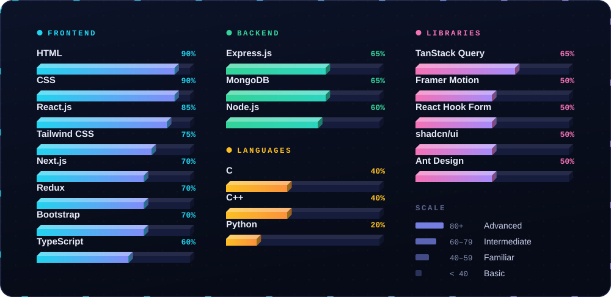

  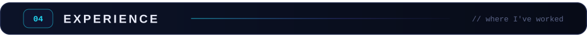
  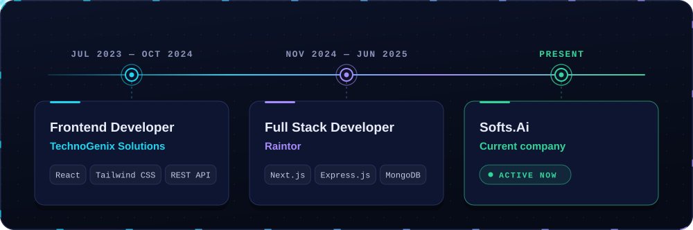

  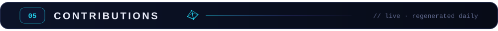
  

  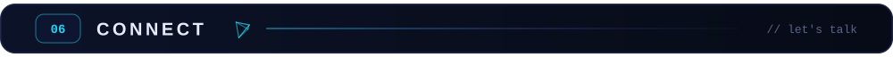

  
  &nbsp;
  
  &nbsp;
  

  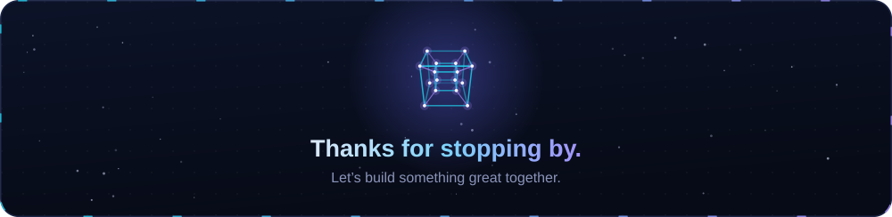

